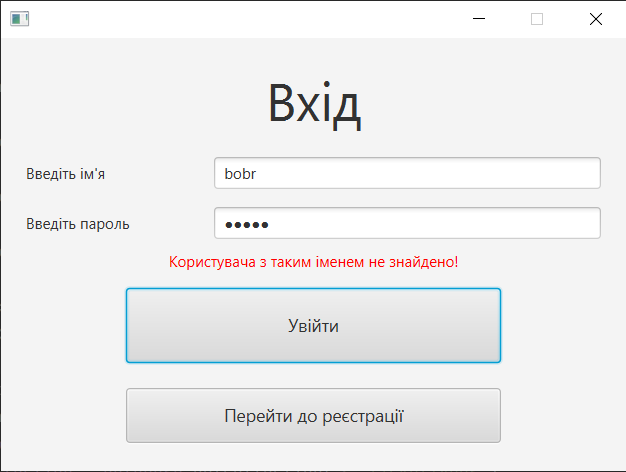
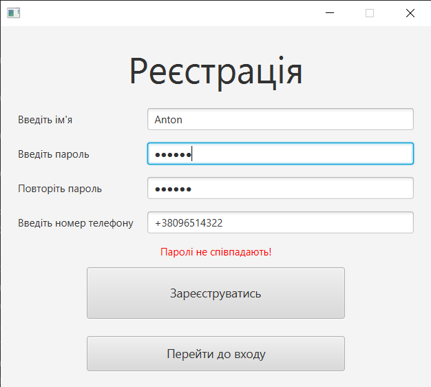
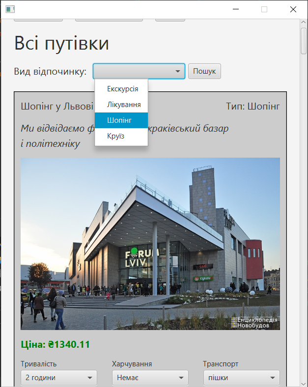
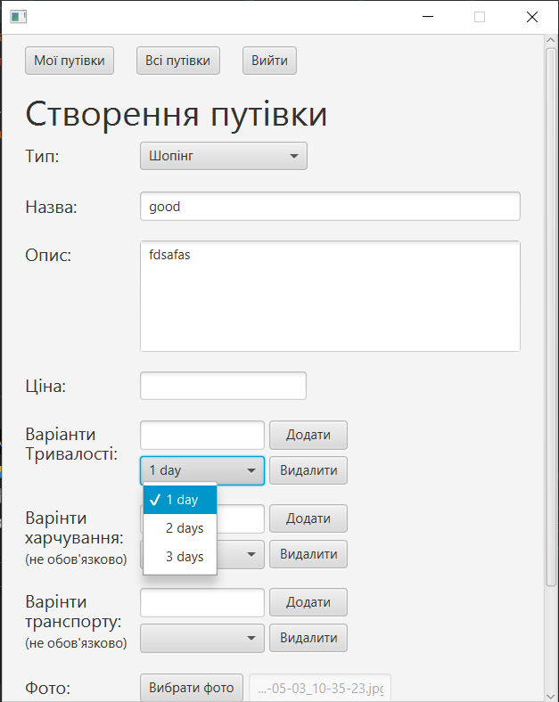

# Tickets-Shop_JavaFX_MongoDB
To make it work, you need to create a MongoDB database. To connect MongoDB to this project, you need to write the appropriate code in the DBManager.java class located in src/main/java/application/. In this class, you need to establish a connection to your MongoDB database. The database should contain the following collections: users, ticketTypes, and tickets. The current name of the database is ApplicationDatabase.

